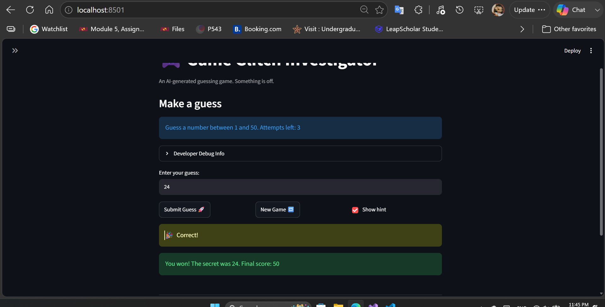

# 🎮 Game Glitch Investigator: The Impossible Guesser

## 🚨 The Situation

You asked an AI to build a simple "Number Guessing Game" using Streamlit.
It wrote the code, ran away, and now the game is unplayable. 

- You can't win.
- The hints lie to you.
- The secret number seems to have commitment issues.

## 🛠️ Setup

1. Install dependencies: `pip install -r requirements.txt`
2. Run the broken app: `python -m streamlit run app.py`

## 🕵️‍♂️ Your Mission

1. **Play the game.** Open the "Developer Debug Info" tab in the app to see the secret number. Try to win.
2. **Find the State Bug.** Why does the secret number change every time you click "Submit"? Ask ChatGPT: *"How do I keep a variable from resetting in Streamlit when I click a button?"*
3. **Fix the Logic.** The hints ("Higher/Lower") are wrong. Fix them.
4. **Refactor & Test.** - Move the logic into `logic_utils.py`.
   - Run `pytest` in your terminal.
   - Keep fixing until all tests pass!

## 📝 Document Your Experience

### Game's Purpose
The Number Guessing Game is a Streamlit-based interactive game where players attempt to guess a randomly selected secret number within a difficulty-based range (Easy: 1-20, Normal: 1-50, Hard: 1-100). 
Players receive hints to guide their guesses and earn points based on how quickly they find the number, with bonus points for fewer attempts. The game tracks attempt history and provides a score system that rewards efficient guessing.

### Bugs Found
1.When the player's guess was higher than the secret, the game said "Go HIGHER" instead of "Go LOWER", and vice versa. This made it impossible to win using logic.
2.Wrong guesses were rewarded instead of penalized on even-numbered attempts, and "Too High" / "Too Low" outcomes had different penalty values instead of consistent -5 points.
3. Normal and Hard difficulties had reversed ranges, so Hard (1-100) was easier than Normal (1-50).

### Fixes Applied
1. Corrected `check_guess()` in logic_utils.py to return "Go LOWER" when guess > secret and "Go HIGHER" when guess < secret.
2. Modified `update_score()` to consistently apply -5 point penalty for all wrong guesses, regardless of attempt number or outcome type.
3. Updated `get_range_for_difficulty()` to properly map Easy: 1-20, Normal: 1-50, Hard: 1-100 in ascending order of difficulty.


## 📸 Demo Walkthrough

Describe your fixed game in numbered steps so a reader can follow along without watching a video:

1. The game is in Normal (range is from 1 to 50)
2. User enters a guess of 45 → "Go Lower"
3. User enters a guess of 36 → "Go Lower"
4. User enters a guess of 24 → "You won! The secret was 24. Final score: 50"
5. Game ends after the correct guess

**Screenshot** *(optional)*: <!-- Insert a screenshot of your fixed, winning game here -->



## 🧪 Test Results

```
============================= test session starts =============================
platform win32 -- Python 3.13.7, pytest-9.0.3, pluggy-1.6.0
collected 25 items

tests/test_game_logic.py::test_winning_guess PASSED                      [  4%]
tests/test_game_logic.py::test_guess_too_high PASSED                     [  8%]
tests/test_game_logic.py::test_guess_too_low PASSED                      [ 12%]
tests/test_game_logic.py::test_fixme1_too_high_message PASSED            [ 16%]
tests/test_game_logic.py::test_fixme1_too_low_message PASSED             [ 20%]
tests/test_game_logic.py::test_fixme2_string_secret_rejected PASSED      [ 24%]
tests/test_game_logic.py::test_fixme3_wrong_guess_penalty_on_odd_attempt PASSED [ 28%]
tests/test_game_logic.py::test_fixme3_wrong_guess_penalty_on_even_attempt PASSED [ 32%]
tests/test_game_logic.py::test_fixme3_multiple_wrong_attempts PASSED     [ 36%]
tests/test_game_logic.py::test_fixme4_too_high_and_too_low_same_penalty PASSED [ 40%]
tests/test_game_logic.py::test_fixme4_penalty_consistency PASSED         [ 44%]
tests/test_game_logic.py::test_fixme6_score_reset_logic PASSED           [ 48%]
tests/test_game_logic.py::test_fixme7_attempt_limits_scaled_correctly PASSED [ 52%]
tests/test_game_logic.py::test_fixme7_hard_has_largest_range PASSED      [ 56%]
tests/test_game_logic.py::test_fixme8_attempts_left_never_negative PASSED [ 60%]
tests/test_game_logic.py::test_fixme8_correct_range_display PASSED       [ 64%]
tests/test_game_logic.py::test_fixme9_difficulty_ranges_containment PASSED [ 68%]
tests/test_game_logic.py::test_fixme9_secret_regeneration_scenario PASSED [ 72%]
tests/test_game_logic.py::test_fixme11_bounds_parse_valid_integers PASSED [ 76%]
tests/test_game_logic.py::test_fixme11_bounds_check_within_range PASSED  [ 80%]
tests/test_game_logic.py::test_fixme11_bounds_check_out_of_range PASSED  [ 84%]
tests/test_game_logic.py::test_fixme13_parse_guess_integer_validation PASSED [ 88%]
tests/test_game_logic.py::test_fixme13_parse_guess_float_to_int_conversion PASSED [ 92%]
tests/test_game_logic.py::test_fixme13_parse_guess_rejects_empty PASSED  [ 96%]
tests/test_game_logic.py::test_fixme13_history_contains_only_valid_ints PASSED [100%]

============================= 25 passed in 0.07s ================================
```

## 🚀 Stretch Features

- [ ] [If you choose to complete Challenge 4, describe the Enhanced UI changes here — a screenshot is optional]
